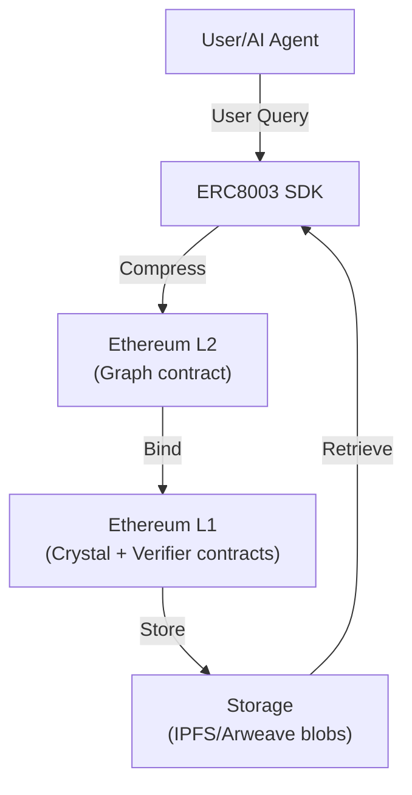
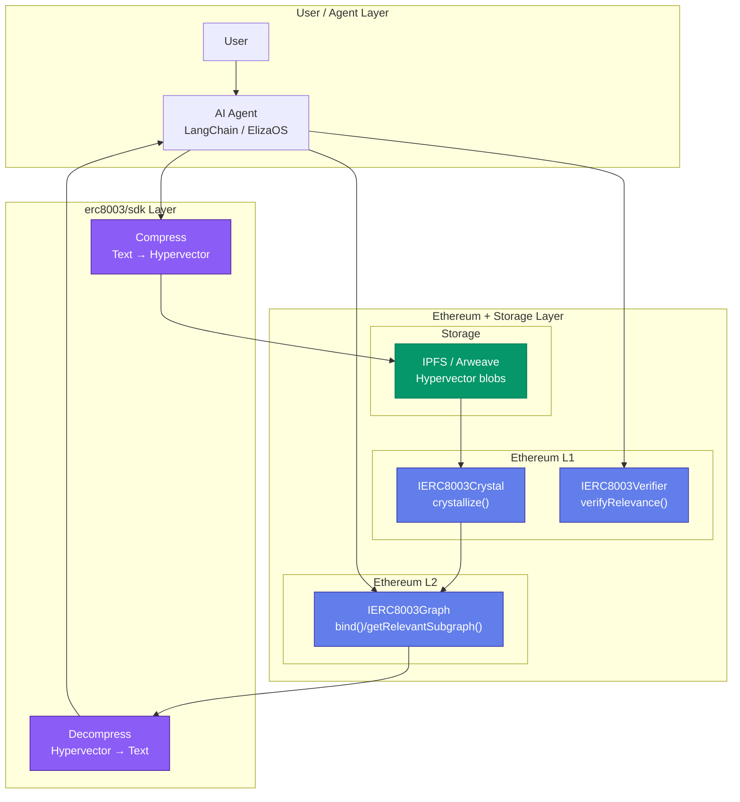
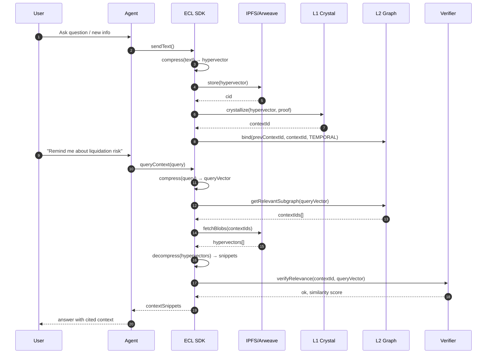
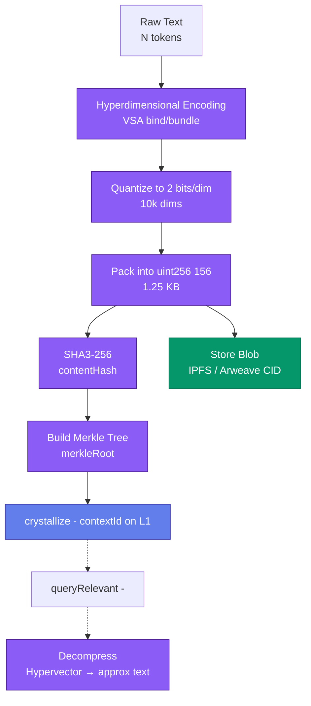
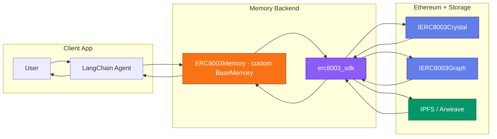
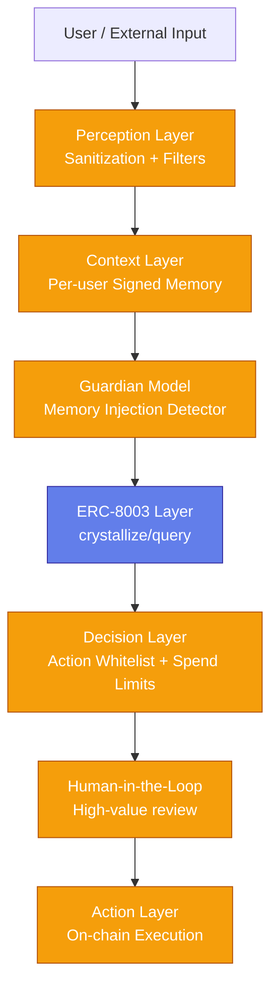

# EIP-8003: Epistemic Context Lattice (ECL) Standard
## A Standard for Verifiable, Compressed AI Context on Ethereum
### Status: Draft
### Type: Standards Track - ERC
### Category: ERC
### Author: @hyperkit-dev
### Created: 2026-02-07
### Requires: ERC-721, ERC-1155, EIP-4337, EIP-712, ERC-8004

# 📋 Abstract
This proposal defines a standard protocol for representing, compressing, and verifying Large Language Model (LLM) context windows as on-chain attestations. The Epistemic Context Lattice (ECL) enables AI agents to maintain cryptographically provable, infinitely extensible memory while reducing storage costs by 1000x through hyperdimensional computing and Merkleized differential state.

## The standard specifies:
- ERC-8003-Context: Interface for compressed context NFTs
- ERC-8003-Graph: Schema for knowledge graph attestations
- ERC-8003-Verifier: On-chain verification of context integrity

## Core Concepts
| Component         | Solidity Interface | Purpose                                    |
| ----------------- | ------------------ | ------------------------------------------ |
| Context Crystal   | IERC8003Crystal    | Hyperdimensional vector storage (10K dims) |
| Epistemic Graph   | IERC8003Graph      | Semantic relationship attestation          |
| Merkle Context    | IERC8003Merkle     | Differential state verification            |
| Memory Controller | IERC8003Controller | On-chain memory economics                  |

## Who Its for
| Persona             | Use Case                          | Implementation                          |
| ------------------- | --------------------------------- | --------------------------------------- |
| AI Agent Developers | Build agents with infinite memory | Import @erc8003/sdk                     |
| DeFi Protocols      | Verifiable oracle context         | Integrate ERC8003Verifier contract      |
| DAO Operators       | Transparent governance AI         | Deploy ECLGovernanceAdapter             |
| Data Curators       | Sell high-quality context graphs  | Mint context as ERC-1155 semi-fungibles |
| Model Providers     | Prove training data provenance    | Anchor dataset hashes via ECL           |
- Layer 2s: Optimism/Arbitrum for cheap graph updates
- Storage Networks: IPFS/Arweave for hypervector blobs
- ZK Provers: RISC Zero/Axiom for private similarity proofs
- AI Frameworks: LangChain/LlamaIndex plugins

# Example Flow

# 1. Core Architecture (Layered Stack)

# 2. Sequence Diagram: Full Write/Read Flow (Temporal Interactions)

# 3. Flowchart: Compression Pipeline (Process Flow)

# 4. Agent Integration Example (LangChain Flow)

# 5. Security Layers (Defense‑in‑Depth)

## [Read more click this]()
